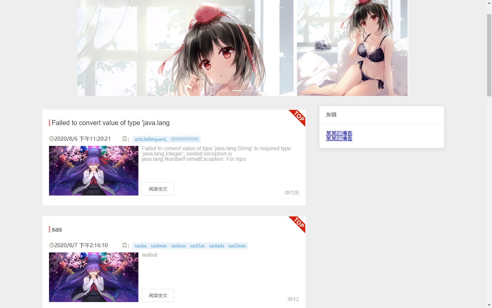
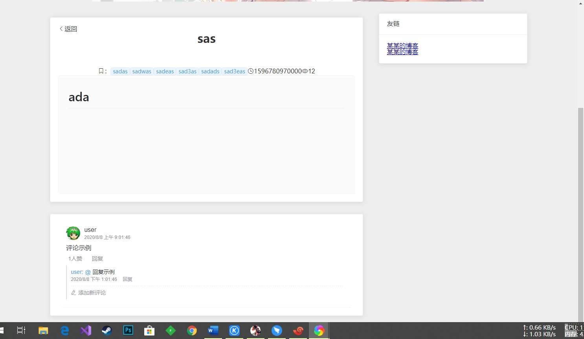
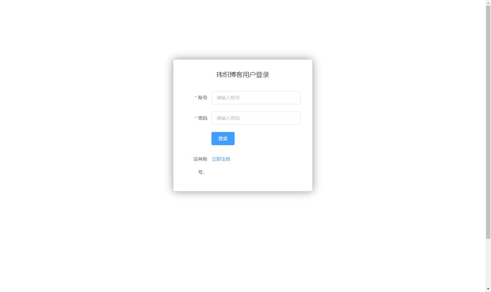
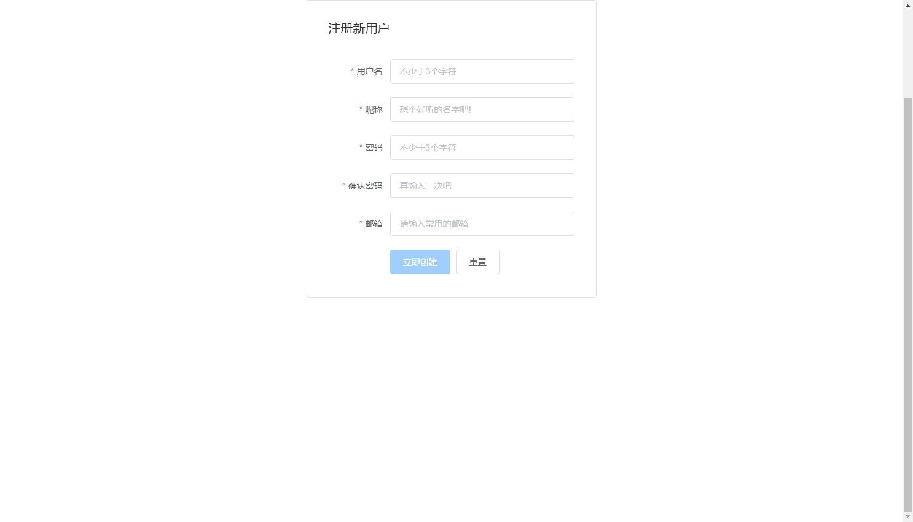
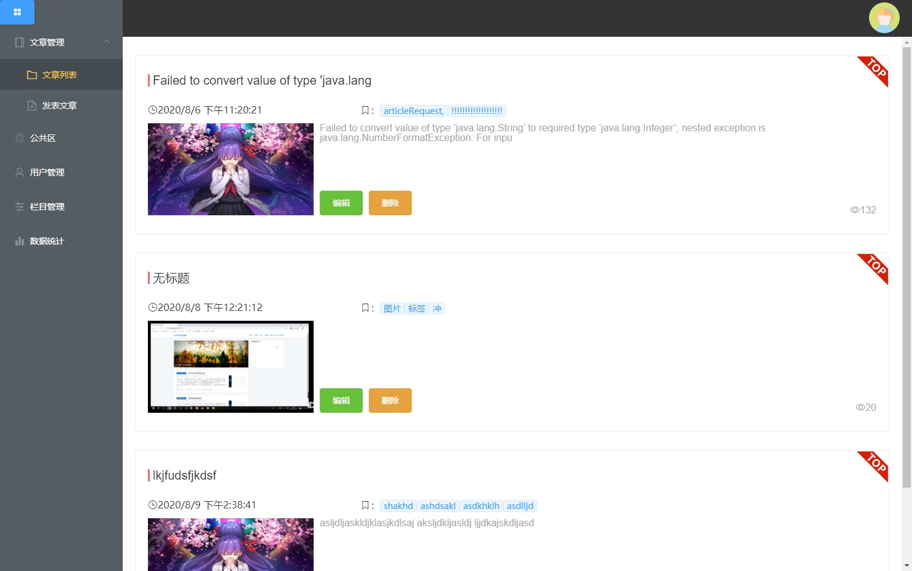
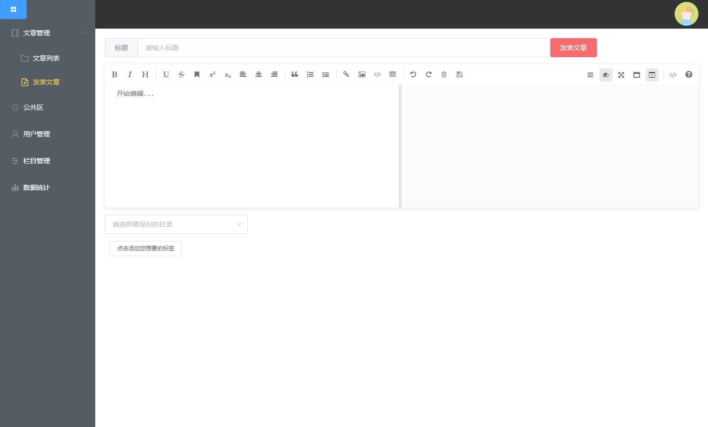
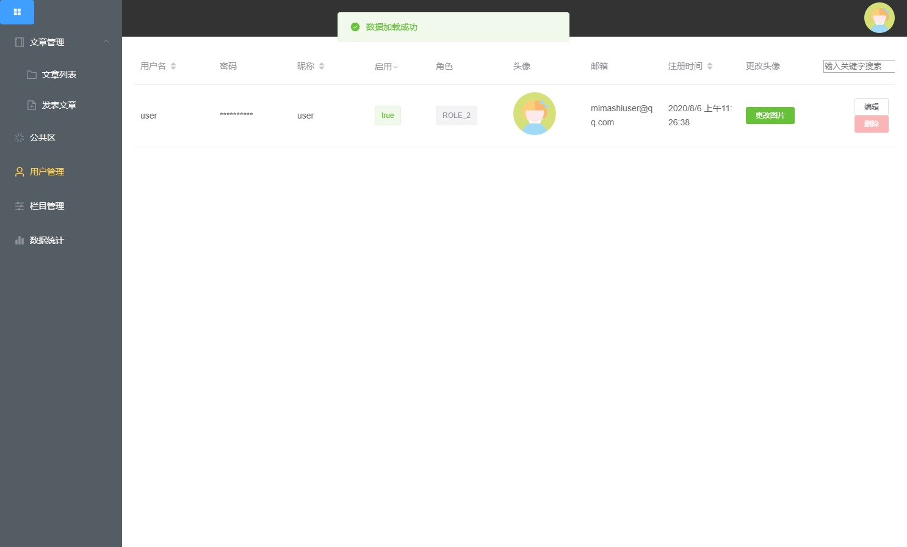
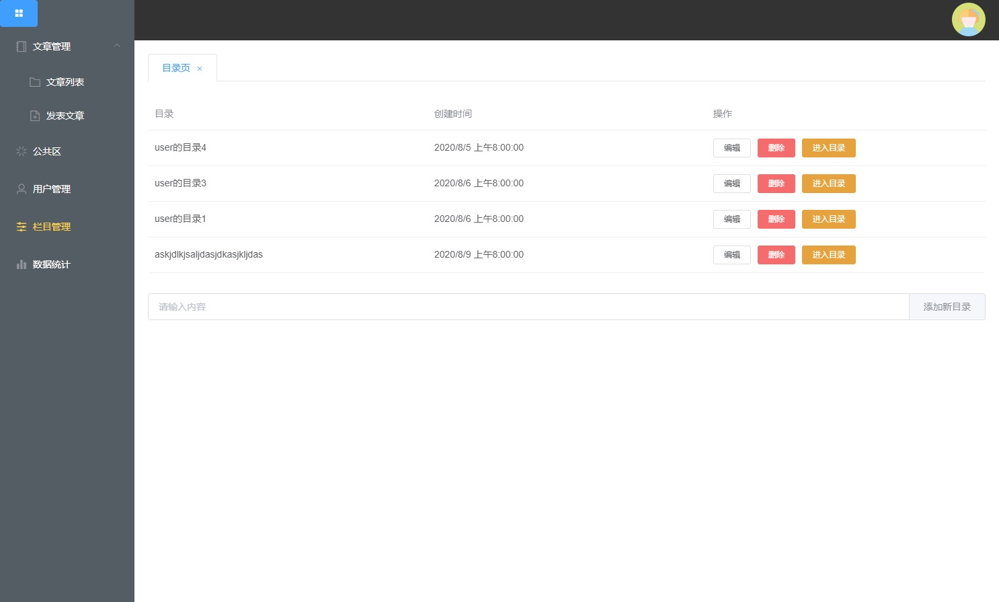
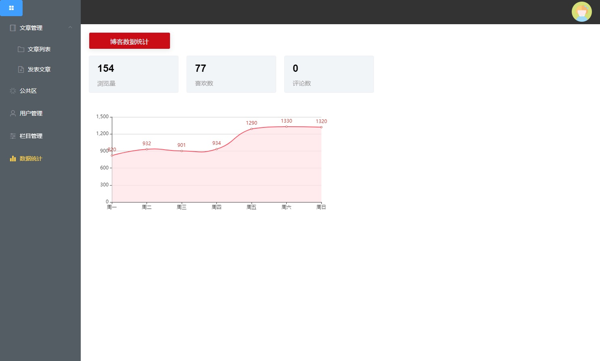
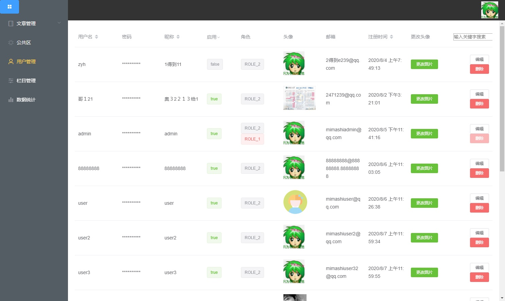

# 玮织博客
> https://github.com/Touka-ch/WeizhiBlog/edit/master/readme.md
## 接口文档
> https://www.showdoc.com.cn/weizhiblog?page_id=4999291931384042
## 接口测试（Postman）
> https://documenter.getpostman.com/view/11010527/T1Dv9FAc?version=latest

## 后端
### 技术选用
* Java11
* Springboot2
* Mybatis3
* springsecurity5
* mysql8
* ...
### 运行
1. clone项目至本地
2. 导入maven项目
3. 配置springbooot启动类
4. 建库
  * 建库 库名 weizhiblog
  * 运行 sql 包下的sql文件
5. 修改applciation.yml配置适配你的环境
6. Run
7. 访问 localhost:port，如果出现 message：'未登录'，则成功！
### 部署
#### docker 部署
1. linux安装docker，docker-compose，谷歌。
2. linux导出docker证书，请谷歌。
3. idea连接docker，请谷歌
  - 注：请不要直接开放docker端口，因docker有su权限，会遭到恶意镜像挖矿，或将你的机器变为肉鸡。（折腾我一天的教训，万恶的黑客）
4. 配置pom.xml，Dockerfile。见https://blog.csdn.net/boling_cavalry/article/details/100051325。
5. 运行Dockerfile。
6. 启动docker容器。
  - 注：docker默认网络连接模式为桥接。
  - 如不想配置docker内网络连接，请使用host模式 --net=host。
7. idea的services里查看日志。
##### 其它部署
1. 待定

## 前端技术
* Vue
* element-ui
* axios
* echarts
* mavon-editor
* scss
* eslint/prettier

### 运行
1. 克隆项目
2. 依次安装上述插件（npm install ..）
3. npm run serve
4. 系统自动打开浏览器访问8080端口的网页 即成功

### 部署
* 可以使用 nginx / apache 等服务器作为配置环境
1. 在 frontend目录下 运行 npm run build
2. 将dist全部文件放到网站根目录
3. 以 nginx 为例，在 nginx.conf 中加入如下跨域配置
* ip自己设置
```
    #代理
   location /api/ {
            proxy_pass http://8.8.8.8/;
        }
```
4. 访问网站根目录ip+端口 即可成功

## 界面预览












示例http://47.102.219.118/
